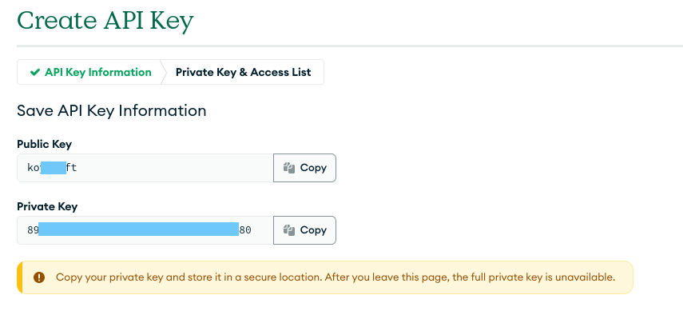

# MongoDb Atlas Cluster

Useful links:

| Description                                  | Link                                                                                           |
|----------------------------------------------|------------------------------------------------------------------------------------------------|
| Provider documentation                       | https://registry.terraform.io/providers/mongodb/mongodbatlas/latest                            |
| Provider environment variables configuration | https://registry.terraform.io/providers/mongodb/mongodbatlas/latest/docs#environment-variables |
| Grant Programmatic Access to Atlas           | https://www.mongodb.com/docs/atlas/configure-api-access/#grant-programmatic-access-to-service  |
| Create an API Key in an Organization         | https://www.mongodb.com/docs/atlas/configure-api-access/#create-an-api-key-in-an-organization  |

## Pre-requisites

* An MongoDb Atlas account
* Public & Private MongoDb Atlas Access Keys (see _Getting credentials_ step)

## Getting credentials

Credentials can be generated in the _Access Manager_ section of the MongoDb Atlas organization.
Select the _API Keys_ tab, and _Create an API Key_ :

Give your API Key a name, and select the _Organization Admin_ role :

Take note of the generated _Public Key_ and _Private Key_.

## Required env vars

This project needs 2 environment variables in order to be run :

| env                       | value                                          |
|---------------------------|------------------------------------------------|
| MONGODB_ATLAS_PUBLIC_KEY  | The Public Key generated at the previous step  |
| MONGODB_ATLAS_PRIVATE_KEY | The Private Key generated at the previous step |

## Running the code

The code manages a MongoDb Atlas project, using the `environment` variable as its name. The project contains a cluster
deployed on a specific region of GCP Cloud.
The cluster will have a user and a database.
Outputs give the connection url of the cluster, and the credentials of the user.

### Inputs

| Name                                                                              | Description                                                             | Type                                                                                    | Default | Required |
|-----------------------------------------------------------------------------------|-------------------------------------------------------------------------|-----------------------------------------------------------------------------------------|---------|:--------:|
|  [cluster\_name](#input\_cluster\_name)          | the name of the cluster                                                 | `string`                                                                                | n/a     |   yes    |
|  [database\_user](#input\_database\_user)       | the user to create on the cluster and its database name the user should | <pre>object({     username      = string     database_name = string   })</pre> | n/a     |   yes    |
|  [environment](#input\_environment)               | the name of the environment for the cluster                             | `string`                                                                                | n/a     |   yes    |
|  [organization\_id](#input\_organization\_id) | the organization in which to create the cluster                         | `string`                                                                                | n/a     |   yes    |

### Outputs

| Name                                                                       | Description                                      |
|----------------------------------------------------------------------------|--------------------------------------------------|
|  [standard\_srv](#output\_standard\_srv) | the connection url to the database               |
|  [user](#output\_user)                           | username and password to connect to the database |
